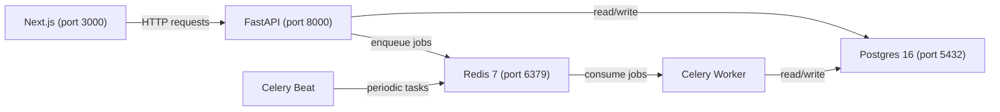
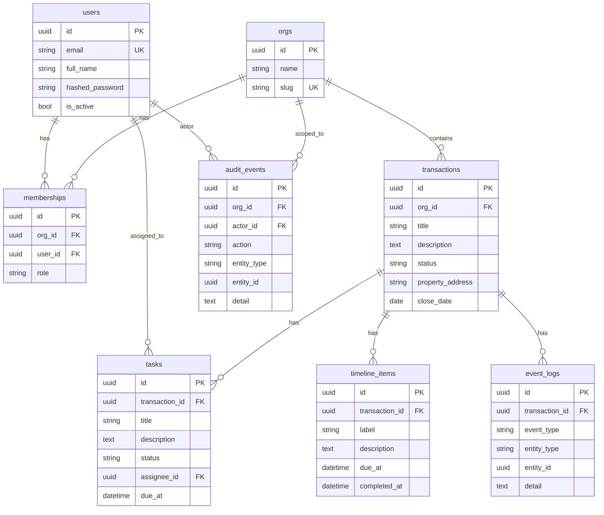

# Transaction Control -- Standard Operating Procedure

Transaction Control is the first layer of Doma. It is the **source of truth for a real-estate deal**. It stores the deal, generates the timeline, tracks deadlines, creates tasks, escalates risk, and logs everything.

Think of it as five interlocking pieces:

| Piece | Role | Maps to |
|---|---|---|
| **Database** (Postgres) | The deal memory | `apps/api/src/tc/db/` |
| **API** (FastAPI) | The doors to read/write that memory | `apps/api/src/tc/api/` |
| **Workers** (Celery) | The engines that run background logic | `apps/api/src/tc/workers/` |
| **Scheduler** (Celery Beat) | The clock that checks deadlines | `apps/api/src/tc/workers/celery_app.py` |
| **UI** (Next.js) | The control panel agents use | `apps/web/` |

---

## Table of Contents

1. [Architecture](#architecture)
2. [Database Schema](#database-schema)
3. [Repository Structure](#repository-structure)
4. [Tech Stack](#tech-stack)
5. [What is Already Built](#what-is-already-built)
6. [What Needs to be Built](#what-needs-to-be-built)
7. [Local Setup](#local-setup)
8. [Key Concepts and Code Rules](#key-concepts-and-code-rules)
9. [Three-Week Task Plan](#three-week-task-plan)
10. [Git Workflow and PR Rules](#git-workflow-and-pr-rules)
11. [Useful Commands](#useful-commands)
12. [Communication](#communication)

---

## Architecture



**How data flows (end-to-end story):**

1. **Create a transaction** -- User creates a deal via the API. The API saves it to Postgres, emits a `TRANSACTION_CREATED` event, and enqueues a `generate_timeline` job onto Redis.
2. **Timeline generator runs** -- The Celery Worker picks up the job, loads a timeline template, and writes milestones + deadlines + tasks to the DB.
3. **Deadline monitor runs every 15 minutes** -- Celery Beat fires `check_deadlines`. The Worker checks all deadlines, marks overdue ones, emits `DEADLINE_OVERDUE` events, and creates escalation tasks.
4. **UI shows reality** -- The Next.js dashboard reads deadline states, tasks, and risk scores from the API and displays what should happen next.

---

## Database Schema

Every table inherits from a shared `Base` model that provides:
- `id` -- UUID primary key (auto-generated)
- `created_at` -- timestamp, set on insert
- `updated_at` -- timestamp, updated on every write

The base model lives in `apps/api/src/tc/db/base.py`.

### Tables



### Table-by-table explanation

**`orgs`** -- An organisation (brokerage). All data is scoped to an org. Multi-tenancy boundary.

**`users`** -- A person who can log in. Has email + bcrypt-hashed password. The `is_active` flag lets you soft-disable accounts.

**`memberships`** -- The join table between users and orgs. The `role` column controls permissions (`member`, `admin`). A user can belong to multiple orgs. There is a unique constraint on `(org_id, user_id)`.

**`transactions`** -- The deal itself. Has a lifecycle status: `draft` -> `active` -> `closed` / `cancelled`. Linked to an org. Optionally stores `property_address` and `close_date`.

**`tasks`** -- Work items inside a deal. Status lifecycle: `todo` -> `in_progress` -> `done`. The deadline service can flip status to `overdue` if `due_at` passes. Optionally assigned to a user via `assignee_id`.

**`timeline_items`** -- Milestone markers on a deal timeline. Each has a `label`, optional `due_at`, and `completed_at` (set when the milestone is done). Created by the timeline generator.

**`audit_events`** -- The "who changed what" log. Records the `actor_id` (which user), the `action` (e.g. `task.marked_overdue`), the target entity (`entity_type` + `entity_id`), and a JSON `detail` string. Scoped to an org. The `actor_id` is null for system-initiated actions (like the deadline checker).

**`event_logs`** -- The "what happened" log. Scoped to a transaction rather than an org. Records things like `task.overdue` or `timeline.generated`. Used to power automations and the audit feed.

**Audit events vs Event logs**: Audit events answer "who did this and when" (human-readable trail). Event logs answer "what happened in this deal" (machine-readable, used to trigger rules and automations).

### Migrations

Migrations live in `apps/api/src/tc/db/migrations/versions/`. There are currently two:

| Migration | What it does |
|---|---|
| `1087cb75961c_initial_schema.py` | Creates all 7 original tables (orgs, users, memberships, transactions, tasks, timeline_items, audit_events) |
| `a3d5f1e2c8b4_add_event_logs_table.py` | Adds the `event_logs` table |

---

## Repository Structure

```
transaction-control/
|-- .editorconfig                  # Editor formatting rules (indent, EOL)
|-- .env.example                   # Template for environment variables
|-- .gitignore                     # Git ignore rules
|-- CONTRIBUTING.md                # Code rules, branch workflow, testing guide
|-- README.md                      # This file (SOP)
|
|-- .github/
|   |-- CODEOWNERS                 # Auto-assigns PR reviewers
|   |-- pull_request_template.md   # PR description template
|   |-- ISSUE_TEMPLATE/
|   |   |-- bug.md                 # Bug report template
|   |   |-- feature.md             # Feature request template
|   |-- workflows/
|       |-- ci.yml                 # GitHub Actions: lint + format + tests
|
|-- apps/
|   |-- api/                       # Python backend (FastAPI)
|   |   |-- alembic.ini            # Alembic config (points to migrations)
|   |   |-- pyproject.toml         # Python deps + project metadata
|   |   |-- uv.lock                # Lockfile for uv package manager
|   |   |-- src/tc/
|   |       |-- __init__.py
|   |       |-- main.py            # FastAPI app entry point
|   |       |
|   |       |-- api/v1/            # HTTP route handlers
|   |       |   |-- router.py      # Mounts all sub-routers
|   |       |   |-- auth.py        # POST /auth/login, POST /auth/dev-token
|   |       |   |-- health.py      # GET /health (public, no auth)
|   |       |   |-- transactions.py # CRUD for deals (fully implemented)
|   |       |   |-- tasks.py       # STUB -- needs endpoints built
|   |       |   |-- timeline.py    # STUB -- needs endpoints built
|   |       |   |-- audit.py       # STUB -- admin-gated, needs endpoints
|   |       |   |-- admin.py       # POST /admin/check-deadlines
|   |       |
|   |       |-- core/              # App-wide config and security
|   |       |   |-- config.py      # Pydantic settings (DB URL, JWT, Redis)
|   |       |   |-- security.py    # JWT encode/decode, bcrypt, RBAC deps
|   |       |   |-- logging.py     # Logging config
|   |       |
|   |       |-- db/                # Database layer
|   |       |   |-- base.py        # SQLAlchemy Base (UUID pk, timestamps)
|   |       |   |-- session.py     # Engine + SessionLocal + get_db dep
|   |       |   |-- models/        # ORM models (one file per table)
|   |       |   |   |-- __init__.py    # Re-exports all models
|   |       |   |   |-- org.py         # Org model
|   |       |   |   |-- user.py        # User model
|   |       |   |   |-- membership.py  # Membership model (org <-> user)
|   |       |   |   |-- transaction.py # Transaction model + TransactionStatus enum
|   |       |   |   |-- task.py        # Task model
|   |       |   |   |-- timeline.py    # TimelineItem model
|   |       |   |   |-- audit.py       # AuditEvent model
|   |       |   |   |-- event_log.py   # EventLog model
|   |       |   |-- migrations/
|   |       |       |-- env.py         # Alembic environment
|   |       |       |-- versions/      # Migration files
|   |       |
|   |       |-- domain/            # Pure business logic (no DB, no HTTP)
|   |       |   |-- enums.py       # TaskStatus enum (todo/in_progress/done/overdue)
|   |       |   |-- models.py      # EMPTY -- domain objects go here
|   |       |   |-- rules.py       # EMPTY -- rules engine goes here
|   |       |
|   |       |-- services/          # Business logic that uses the DB
|   |       |   |-- auth_service.py        # authenticate_user (email + password)
|   |       |   |-- transaction_service.py # create, get, list, membership check
|   |       |   |-- timeline_service.py    # generate_default_timeline (5 tasks)
|   |       |   |-- deadline_service.py    # check_deadlines (mark overdue + log)
|   |       |   |-- audit_service.py       # create_audit_event, list by transaction
|   |       |   |-- task_service.py        # EMPTY -- task CRUD goes here
|   |       |
|   |       |-- workers/           # Celery background jobs
|   |       |   |-- celery_app.py  # Celery instance + beat schedule
|   |       |   |-- tasks.py       # generate_timeline, check_deadlines_task
|   |       |   |-- beat_schedule.py # (config moved to celery_app.py)
|   |       |
|   |       |-- tests/             # pytest test suite
|   |           |-- conftest.py    # SQLite in-memory DB, fixtures, auth helpers
|   |           |-- test_auth.py   # Auth + RBAC tests (8 tests)
|   |           |-- test_transactions.py # Transaction CRUD + timeline tests (11 tests)
|   |           |-- test_deadlines.py    # Deadline engine tests (7 tests)
|   |           |-- test_health.py       # Health endpoint test (1 test)
|   |
|   |-- web/                       # Next.js frontend
|       |-- package.json           # Next.js 14, React 18
|       |-- src/
|           |-- app/
|           |   |-- layout.tsx     # Root layout (bare shell)
|           |   |-- page.tsx       # Placeholder page
|           |   |-- (auth)/        # EMPTY -- login page goes here
|           |   |-- dashboard/     # EMPTY -- dashboard pages go here
|           |-- components/        # EMPTY -- shared components go here
|           |-- lib/
|               |-- api.ts         # EMPTY -- fetch wrapper goes here
|               |-- auth.ts        # EMPTY -- token storage goes here
|               |-- types.ts       # EMPTY -- TypeScript interfaces go here
|
|-- docs/
|   |-- api.md                     # Full API reference with examples
|   |-- architecture.md            # Architecture overview (short)
|   |-- local-dev.md               # Local dev quick reference
|   |-- decisions/
|       |-- 0001-tech-stack.md     # ADR: tech stack choices
|       |-- 0002-db-schema.md      # ADR: initial schema design
|
|-- infra/
|   |-- docker-compose.yml         # 6 services: db, redis, api, worker, beat, web
|   |-- docker/
|       |-- Dockerfile.api         # Python API container
|       |-- Dockerfile.web         # Next.js container
|       |-- Dockerfile.worker      # Celery worker container
|
|-- packages/
|   |-- shared/
|       |-- openapi/               # EMPTY -- generated OpenAPI specs later
|       |-- types/                 # EMPTY -- shared types later
|
|-- scripts/
    |-- dev.sh                     # Dev startup helper
    |-- fmt.sh                     # Format + lint script
    |-- seed_db.py                 # Seeds DB with dev org + admin user
```

---

## Tech Stack

| Layer | Technology | Version |
|---|---|---|
| Language (backend) | Python | 3.12 |
| API framework | FastAPI | latest |
| ORM | SQLAlchemy | 2.0 |
| Migrations | Alembic | latest |
| Task queue | Celery | latest |
| Message broker / cache | Redis | 7 |
| Database | PostgreSQL | 16 |
| Package manager (Python) | uv | latest |
| Linter / Formatter | Ruff | latest |
| Tests | pytest | latest |
| Frontend framework | Next.js | 14 |
| UI library | React | 18 |
| Frontend language | TypeScript | latest |
| Containers | Docker Compose | latest |
| CI | GitHub Actions | -- |

---

## What is Already Built

This section lists everything that is **done and working**. Do not rebuild these -- read and understand them.

### Infrastructure
- Docker Compose with 6 services: Postgres, Redis, API, Worker, Beat, Web (`infra/docker-compose.yml`)
- Three Dockerfiles (`infra/docker/Dockerfile.api`, `Dockerfile.web`, `Dockerfile.worker`)
- GitHub Actions CI pipeline that runs lint + format check + tests on every PR (`.github/workflows/ci.yml`)
- Seed script that creates a dev org (`dev-org`) and admin user (`admin@dev.local` / `password123`) (`scripts/seed_db.py`)

### Authentication and Authorization
- JWT-based auth with login endpoint (`POST /api/v1/auth/login`) and dev-token endpoint (`POST /api/v1/auth/dev-token`)
- `require_user` dependency -- validates JWT, loads user, rejects inactive users (returns 401)
- `require_role(role)` dependency -- wraps `require_user`, checks membership role (returns 403)
- `CurrentUser` and `AdminUser` type aliases for use in route signatures
- bcrypt password hashing
- All of this lives in `apps/api/src/tc/core/security.py`

### Transaction CRUD
- `POST /api/v1/transactions` -- create a deal, auto-enqueues `generate_timeline` worker job
- `GET /api/v1/transactions/{id}` -- get deal with nested tasks
- `GET /api/v1/transactions` -- list all deals for the user's orgs
- `GET /api/v1/transactions/{id}/tasks` -- list tasks for a deal
- `GET /api/v1/transactions/{id}/audit` -- audit trail for a deal and its tasks
- All enforce org membership checks (403 if not a member)
- Service layer: `services/transaction_service.py`
- Router: `api/v1/transactions.py`

### Timeline Generator
- `services/timeline_service.py` -- `generate_default_timeline()` creates 5 tasks + 5 timeline items with staggered due dates (3, 7, 14, 21, 28 days from now)
- Currently uses a hardcoded template list (needs to be refactored to JSON config)
- Triggered as a Celery task on transaction creation

### Deadline Engine
- `services/deadline_service.py` -- `check_deadlines()` finds tasks past their `due_at`, marks them `overdue`, emits event_log + audit_event entries
- Idempotent: running twice does not create duplicate logs
- Runs on Celery Beat schedule every 15 minutes
- Can be triggered manually: `POST /api/v1/admin/check-deadlines` (admin only)

### Audit System
- `services/audit_service.py` -- `create_audit_event()` and `list_audit_events_for_transaction()`
- Audit events are created automatically when the deadline engine marks tasks overdue

### Workers
- `workers/tasks.py` -- two Celery tasks: `generate_timeline` and `check_deadlines_task`
- Both use `acks_late=True`, open their own DB session, delegate to service functions
- `workers/celery_app.py` -- Celery instance with beat schedule configured

### Tests (27+ tests passing)
- `test_auth.py` -- login, dev-token, protected endpoints, expired tokens, garbage tokens (8 tests)
- `test_transactions.py` -- create, get, list, timeline generation, tasks endpoint, end-to-end (11 tests)
- `test_deadlines.py` -- mark overdue, ignore future, ignore done, idempotency, event/audit log emission (7 tests)
- `test_health.py` -- health endpoint (1 test)
- Test infrastructure: SQLite in-memory DB, auto-reset between tests, `seed_user` fixture

---

## What Needs to be Built

These are the files that are currently **empty stubs**. This is your work.

### Backend

| File | What to build | Owner |
|---|---|---|
| `services/task_service.py` | Task CRUD: create, update status, assign to user, list by transaction, list by user ("my tasks") | Kawalpreet |
| `api/v1/tasks.py` | Task API endpoints: POST create, PATCH update status, PATCH assign, GET list by transaction, GET my tasks | Kawalpreet |
| `api/v1/timeline.py` | Timeline API endpoints: GET list items by transaction, PATCH mark item complete | Neeraj |
| `api/v1/audit.py` | Audit API endpoints: GET org-wide audit feed, filter by entity type, pagination | Kawalpreet |
| `domain/rules.py` | Rules engine: deterministic "if X then Y" logic (e.g., if deadline due soon -> create reminder task) | Neeraj |
| `domain/models.py` | Pure domain objects if needed (Pydantic models for rule inputs/outputs) | Neeraj |
| New: `services/health_service.py` | Health scoring: compute GREEN/YELLOW/RED from overdue count, due-soon count, incomplete tasks | Kawalpreet |
| Refactor: `services/timeline_service.py` | Replace hardcoded template with JSON config, support milestone model | Neeraj |
| Refactor: `services/deadline_service.py` | Add "due soon" detection (48h window), severity levels | Neeraj |

### Frontend

| File | What to build | Owner |
|---|---|---|
| `lib/api.ts` | Fetch wrapper with auth token injection | Shared (Day 11) |
| `lib/auth.ts` | Token storage (localStorage), login/logout helpers | Shared (Day 11) |
| `lib/types.ts` | TypeScript interfaces matching API responses | Shared (Day 11) |
| `app/(auth)/` | Login page | Shared (Day 11) |
| `app/dashboard/` | Dashboard layout + pages | Split (see plan) |
| `components/` | Shared UI components (cards, badges, tables) | Split (see plan) |

---

## Local Setup

### Prerequisites
- Docker and Docker Compose
- Git

### Step-by-step

```bash
# 1. Clone the repo
git clone <repo-url> && cd transaction-control

# 2. Copy the environment file
cp .env.example .env

# 3. Start all services (Postgres, Redis, API, Worker, Beat, Web)
cd infra && docker compose up --build -d

# 4. Run database migrations
docker compose exec -w /app/apps/api api uv run alembic upgrade head

# 5. Seed the database with a dev org and admin user
docker compose exec -w /app/apps/api api uv run python /app/scripts/seed_db.py

# 6. Verify the API is running
curl http://localhost:8000/api/v1/health
# Expected: {"ok": true}
```

### Get a dev token (use this for all authenticated requests)

```bash
# Get a JWT without needing a password (local/test only)
curl -s -X POST http://localhost:8000/api/v1/auth/dev-token \
  -H "Content-Type: application/json" \
  -d '{"email": "admin@dev.local"}' | python3 -m json.tool

# Save the token to an environment variable
export TOKEN=$(curl -s -X POST http://localhost:8000/api/v1/auth/dev-token \
  -H "Content-Type: application/json" \
  -d '{"email": "admin@dev.local"}' | python3 -c "import sys,json; print(json.load(sys.stdin)['access_token'])")
```

### Test a real request

```bash
# List transactions (should return empty array initially)
curl -s http://localhost:8000/api/v1/transactions \
  -H "Authorization: Bearer $TOKEN" | python3 -m json.tool

# Create a transaction
curl -s -X POST http://localhost:8000/api/v1/transactions \
  -H "Authorization: Bearer $TOKEN" \
  -H "Content-Type: application/json" \
  -d '{"org_id": "<paste org_id from seed output>", "title": "123 Main St"}' | python3 -m json.tool
```

### Dev credentials (from seed)

| Field | Value |
|---|---|
| Email | `admin@dev.local` |
| Password | `password123` |
| Org name | Dev Organisation |
| Org slug | `dev-org` |
| Role | `admin` |

---

## Key Concepts and Code Rules

Read `CONTRIBUTING.md` for the full version. Here are the rules that matter most:

### 1. Routers never touch the database

Routers call **services**. Services do all DB queries and business logic. Routers handle HTTP concerns only (parse input, call service, format response).

```python
# CORRECT
@router.post("")
def create(body: CreateSchema, user: CurrentUser, db: DB):
    result = my_service.create(db, ...)
    return result

# WRONG -- do not do this
@router.post("")
def create(body: CreateSchema, user: CurrentUser, db: DB):
    obj = MyModel(...)
    db.add(obj)
    db.commit()
    return obj
```

### 2. Org scoping is mandatory

Every endpoint that reads or writes org-scoped data must verify the user belongs to that org. Use `user_belongs_to_org()` from `transaction_service` or check membership explicitly. Never return data by ID alone without a membership check.

### 3. Every endpoint needs tests

At minimum for each endpoint:
- **Happy path** -- valid input + valid auth returns expected result
- **Auth guard** -- no token returns 401
- **Membership check** -- wrong org returns 403

### 4. Celery tasks are thin wrappers

```python
@celery_app.task(name="tc.my_task", acks_late=True)
def my_task(arg: str) -> dict:
    db = SessionLocal()
    try:
        result = my_service.do_thing(db, arg)
        return result
    except Exception:
        logger.exception("my_task failed")
        raise
    finally:
        db.close()
```

Rules: open your own session, close it in `finally`, delegate all logic to a service, use `acks_late=True`, let exceptions propagate.

### 5. Audit events vs Event logs

| | Audit Events | Event Logs |
|---|---|---|
| Scoped to | Org | Transaction |
| Answers | "Who did this and when?" | "What happened in this deal?" |
| Has actor | Yes (`actor_id`) | No |
| Used for | Human-readable trail | Machine-readable triggers, automations |

### 6. Task status lifecycle

```
todo --> in_progress --> done
  \                      
   \--> overdue (set by deadline engine, not by humans)
```

The `TaskStatus` enum is in `domain/enums.py`.

---

## Three-Week Task Plan

**Neeraj** -- Timeline Engine + Deadline Engine + Rules Engine
**Kawalpreet** -- Task Engine + Audit/Health Engine

**PR cadence**: each intern opens a PR to `dev` at the **end of every week (Friday)**. Amaan reviews over the weekend. Monday morning: merge approved PRs, then start the next week's work.

---

### Week 1 -- Backend Services and API Endpoints

**Goal**: Build the core service layers and API endpoints for tasks, timeline, deadlines, and health scoring.

**Friday**: Both open **PR #1** to `dev`.

#### Day 1 (Monday) -- Setup and Orientation

**Both Neeraj and Kawalpreet:**

- [ ] Clone the repo, follow the [Local Setup](#local-setup) section above
- [ ] Run `docker compose up --build -d`, run migrations, seed the DB
- [ ] Verify `curl http://localhost:8000/api/v1/health` returns `{"ok": true}`
- [ ] Get a dev token and create a test transaction via curl
- [ ] Read every file in `docs/` (api.md, architecture.md, local-dev.md, ADRs)
- [ ] Read `CONTRIBUTING.md` end-to-end
- [ ] Read through every file in `services/`, `api/v1/`, and `db/models/` to understand the existing code
- [ ] Run the test suite: `docker compose exec -w /app/apps/api api uv run pytest -v`
- [ ] Create your feature branches:
  - Neeraj: `git checkout -b neeraj/week1-timeline-deadlines`
  - Kawalpreet: `git checkout -b kawalpreet/week1-tasks-health`

#### Day 2 (Tuesday) -- Service Layer

**Neeraj -- Refactor Timeline Service:**
- [ ] Open `services/timeline_service.py`
- [ ] Replace the hardcoded `TEMPLATE_TASKS` list with a JSON-based template config
- [ ] The template should define: task title, offset days from deal creation, description, category/milestone name
- [ ] Make it so different templates can be loaded (e.g., "standard PA deal", "commercial deal") -- for now just build the standard one
- [ ] Keep `generate_default_timeline()` working (existing tests must still pass)
- [ ] Run `uv run pytest -v` to confirm nothing broke

**Kawalpreet -- Build Task Service:**
- [ ] Open `services/task_service.py` (currently empty)
- [ ] Implement these functions:
  - `create_task(db, transaction_id, title, description, assignee_id, due_at)` -- creates a task, returns it
  - `update_task_status(db, task_id, new_status)` -- changes status, creates an audit event
  - `assign_task(db, task_id, assignee_id)` -- sets assignee, creates an audit event
  - `list_tasks_by_transaction(db, transaction_id)` -- returns all tasks for a deal
  - `list_tasks_by_user(db, user_id)` -- returns all tasks assigned to a user across all their orgs ("my tasks")
- [ ] Make sure every write operation also creates an `AuditEvent` via `audit_service.create_audit_event()`
- [ ] Run `uv run pytest -v` to confirm nothing broke

#### Day 3 (Wednesday) -- API Endpoints

**Neeraj -- Timeline API:**
- [ ] Open `api/v1/timeline.py` (currently a stub router)
- [ ] Add endpoints:
  - `GET /api/v1/transactions/{transaction_id}/timeline` -- list all timeline items for a deal
  - `PATCH /api/v1/timeline/{item_id}/complete` -- mark a timeline item as completed (set `completed_at`)
- [ ] All endpoints must check org membership (see how `transactions.py` does it)
- [ ] Return timeline items as JSON dicts (id, label, description, due_at, completed_at)
- [ ] Alternatively, you can nest timeline endpoints under the transactions router if that makes more sense -- discuss with Amaan

**Kawalpreet -- Task API:**
- [ ] Open `api/v1/tasks.py` (currently a stub router)
- [ ] Add endpoints:
  - `POST /api/v1/transactions/{transaction_id}/tasks` -- create a task on a deal
  - `PATCH /api/v1/tasks/{task_id}/status` -- update task status (body: `{"status": "in_progress"}`)
  - `PATCH /api/v1/tasks/{task_id}/assign` -- assign task to a user (body: `{"assignee_id": "uuid"}`)
  - `GET /api/v1/tasks/mine` -- list all tasks assigned to the current user
- [ ] All endpoints must check org membership
- [ ] Call task_service functions, not DB directly

#### Day 4 (Thursday) -- Deadline Expansion and Health Scoring

**Neeraj -- Expand Deadline Service:**
- [ ] Open `services/deadline_service.py`
- [ ] Add a "due soon" detection: find tasks with `due_at` within the next 48 hours that are still `todo` or `in_progress`
- [ ] Emit `task.due_soon` events in the event log for these tasks
- [ ] Add a severity concept: tasks can have severity levels that affect how urgently they escalate
- [ ] Make sure the existing overdue logic still works (run existing tests)

**Kawalpreet -- Build Health Service:**
- [ ] Create a new file: `services/health_service.py`
- [ ] Implement `compute_health_score(db, transaction_id)` that returns:
  - `score`: `GREEN`, `YELLOW`, or `RED`
  - `reasons`: list of strings explaining why (e.g., "2 tasks overdue", "3 tasks due in next 48h")
- [ ] Scoring logic:
  - Any overdue task = `RED`
  - Tasks due within 48h with incomplete status = `YELLOW`
  - Everything else = `GREEN`
- [ ] Add a health score endpoint: `GET /api/v1/transactions/{transaction_id}/health`
- [ ] Wire it into the transactions router or the health router -- up to you

#### Day 5 (Friday) -- Tests and PR

**Both Neeraj and Kawalpreet:**
- [ ] Write tests for every new endpoint and service function
  - Each endpoint: happy path, 401 (no auth), 403 (wrong org)
  - Each service function: happy path, edge cases
- [ ] Run the full test suite: `uv run pytest -v`
- [ ] Run the linter: `uv run ruff check .`
- [ ] Run the formatter: `uv run ruff format --check .`
- [ ] Commit your work with clear commit messages
- [ ] Push your branch and open a PR to `dev`:
  - Neeraj: PR title "Week 1: Timeline service refactor + deadline due-soon + timeline API"
  - Kawalpreet: PR title "Week 1: Task service + task API + health scoring"
- [ ] Fill in the PR template (`.github/pull_request_template.md`)

---

### Week 2 -- Backend Integration and Rules Engine

**Goal**: Build the rules engine, expand audit/event endpoints, integrate all services end-to-end, add any needed migrations.

**Friday**: Both open **PR #2** to `dev`.

#### Day 6 (Monday) -- Rules Engine and Audit Expansion

**Neeraj -- Rules Engine:**
- [ ] Open `domain/rules.py` (currently empty)
- [ ] Build a deterministic rules engine. Rules are "if X then Y" logic:
  - If a deadline becomes "due soon" -> create a reminder task (e.g., "Confirm inspection scheduled")
  - If a task is marked overdue -> create an escalation task assigned to the coordinator
  - If appraisal is received and flagged low -> create a negotiation task
- [ ] Rules should be defined as data (list of dicts or dataclasses), not hardcoded if/else chains
- [ ] The deadline service should call the rules engine after detecting due-soon / overdue tasks
- [ ] Every task created by rules must have a dedupe key to prevent duplicates on re-runs (idempotency)

**Kawalpreet -- Audit Router Expansion:**
- [ ] Open `api/v1/audit.py` (currently a stub)
- [ ] Add endpoints:
  - `GET /api/v1/audit` -- org-wide audit feed (all events across all deals for the user's org)
  - Support query params: `?entity_type=task`, `?action=task.marked_overdue`
  - Support pagination: `?page=1&page_size=20`
- [ ] Keep the admin-only gate (`require_role("admin")`)
- [ ] Build `list_audit_events_for_org(db, org_id, filters, page, page_size)` in `audit_service.py`

#### Day 7 (Tuesday) -- Wiring and Integration

**Neeraj -- Wire Scheduler to New Logic:**
- [ ] Make sure the Celery Beat `check_deadlines` task now:
  1. Marks overdue tasks (existing)
  2. Detects due-soon tasks (new from Day 4)
  3. Runs the rules engine on all newly flagged tasks (new from Day 6)
- [ ] Test manually: `curl -X POST http://localhost:8000/api/v1/admin/check-deadlines -H "Authorization: Bearer $TOKEN"`
- [ ] Verify event_logs and audit_events are created correctly

**Kawalpreet -- Event Logs and Health Recompute:**
- [ ] Add event log query endpoints:
  - `GET /api/v1/transactions/{transaction_id}/events` -- list event logs for a deal
  - Support filtering: `?event_type=task.overdue`
- [ ] Wire health score recompute: when a task status changes (via PATCH), recompute the transaction's health score
- [ ] Consider storing the latest health score on the transaction record (add a column if needed)

#### Day 8 (Wednesday) -- Schema Migrations (if needed)

**Neeraj:**
- [ ] If your rules engine or timeline refactor requires new columns (e.g., `severity` on tasks, `milestone_name` on timeline_items, `dedupe_key` on tasks):
  - Create a new Alembic migration: `docker compose exec -w /app/apps/api api uv run alembic revision --autogenerate -m "add_severity_and_dedupe"`
  - Review the generated migration file
  - Apply: `docker compose exec -w /app/apps/api api uv run alembic upgrade head`

**Kawalpreet:**
- [ ] If health scoring needs a stored score (e.g., `health_score` column on transactions, or a separate health_snapshots table):
  - Create a new Alembic migration
  - Review and apply
- [ ] Update the transaction serialization (`_txn_to_dict` in `transactions.py`) to include health score

#### Day 9 (Thursday) -- Integration Testing

**Both Neeraj and Kawalpreet:**
- [ ] Test the full end-to-end flow together:
  1. Create a transaction via API
  2. Verify timeline items + tasks are generated (check DB or API)
  3. Fast-forward time or manually set `due_at` to the past on a task
  4. Trigger deadline check (`POST /admin/check-deadlines`)
  5. Verify: task marked overdue, event_log created, audit_event created, rules engine created escalation task, health score is RED
  6. Mark the escalation task as done
  7. Verify: health score improves
- [ ] Write integration tests that cover this flow in `tests/`

#### Day 10 (Friday) -- Bug Fixes, Tests, PR

**Both:**
- [ ] Fix any bugs found during integration testing
- [ ] Write remaining unit tests
- [ ] Full test suite pass + lint + format check
- [ ] Commit, push, open PR #2 to `dev`
  - Neeraj: PR title "Week 2: Rules engine + scheduler integration + timeline refactor"
  - Kawalpreet: PR title "Week 2: Audit feed + event logs + health recompute"

---

### Week 3 -- Frontend Dashboard

**Goal**: Build a basic but functional Next.js dashboard that displays transactions, tasks, timeline, health, and audit data.

**Friday**: Both open **PR #3** to `dev`.

#### Day 11 (Monday) -- Shared Frontend Foundations

**Both Neeraj and Kawalpreet (pair on this):**
- [ ] Set up shared frontend infrastructure in `apps/web/src/`:
  - `lib/types.ts` -- TypeScript interfaces matching every API response (Transaction, Task, TimelineItem, AuditEvent, HealthScore, etc.)
  - `lib/api.ts` -- fetch wrapper that injects the auth token from localStorage, handles errors, typed responses
  - `lib/auth.ts` -- `login(email, password)`, `logout()`, `getToken()`, `isAuthenticated()` using localStorage
- [ ] Build the login page in `app/(auth)/login/page.tsx`:
  - Email + password form
  - Calls `POST /api/v1/auth/login`
  - Stores token in localStorage
  - Redirects to `/dashboard`
- [ ] Build the dashboard layout in `app/dashboard/layout.tsx`:
  - Sidebar or top nav with links: Transactions, My Tasks, Audit (if admin)
  - Logout button
- [ ] Test: login -> see empty dashboard -> logout works

#### Day 12 (Tuesday) -- Core Pages

**Neeraj -- Transaction Pages:**
- [ ] `app/dashboard/transactions/page.tsx` -- transaction list page
  - Fetches `GET /api/v1/transactions`
  - Displays as a table: title, status, property address, close date, created at
  - Click a row -> navigate to detail page
- [ ] `app/dashboard/transactions/[id]/page.tsx` -- transaction detail page
  - Fetches `GET /api/v1/transactions/{id}`
  - Shows deal info at top
  - Shows timeline items as a vertical timeline (label, due date, completed status)
  - Shows tasks list below

**Kawalpreet -- Task Pages:**
- [ ] `app/dashboard/tasks/page.tsx` -- "My Tasks" page
  - Fetches `GET /api/v1/tasks/mine`
  - Displays as a table: title, status, due date, transaction title
  - Status badge with color (green for done, yellow for in_progress, red for overdue)
- [ ] Task status toggle on each task row:
  - Click to cycle: todo -> in_progress -> done
  - Calls `PATCH /api/v1/tasks/{id}/status`
  - Optimistic UI update

#### Day 13 (Wednesday) -- Health, Deadlines, Audit

**Neeraj -- Deadline Alerts and Health Indicator:**
- [ ] On the transaction detail page, add:
  - Health score badge (GREEN/YELLOW/RED) fetched from `GET /api/v1/transactions/{id}/health`
  - Reasons list ("why is this red?")
- [ ] On timeline items, add visual indicators:
  - Overdue items: red badge
  - Due soon items: yellow badge
  - Completed items: checkmark

**Kawalpreet -- Audit Feed and Dashboard Card:**
- [ ] `app/dashboard/audit/page.tsx` -- audit feed page (admin only)
  - Fetches `GET /api/v1/audit`
  - Displays as a feed: action, entity type, actor, timestamp, detail
  - Filter by entity type dropdown
- [ ] Dashboard home card (`app/dashboard/page.tsx`):
  - Summary stats: total transactions, tasks overdue, tasks due soon
  - Quick links to deals at risk (RED health)

#### Day 14 (Thursday) -- Polish

**Both:**
- [ ] Add loading states (skeleton or spinner) to all pages
- [ ] Add error states (API fails, 401 redirect to login, 403 message)
- [ ] Responsive layout (works on desktop, reasonable on tablet)
- [ ] Consistent styling across all pages (use a shared CSS approach or Tailwind if you want to add it)

#### Day 15 (Friday) -- Final Testing and PR

**Both:**
- [ ] Test every page end-to-end:
  - Login -> create transaction -> see it in list -> view detail -> see timeline -> see health score
  - View my tasks -> toggle status -> see update
  - View audit feed (as admin)
- [ ] Fix any remaining bugs
- [ ] Commit, push, open PR #3 to `dev`
  - Neeraj: PR title "Week 3: Transaction + timeline + health UI"
  - Kawalpreet: PR title "Week 3: Task UI + audit feed + dashboard"
- [ ] Prepare a short demo (5 min screen recording or live walkthrough)

---

## Git Workflow and PR Rules

### Branch strategy

```
main (production-ready, protected)
  |
  +-- dev (integration branch, protected)
        |
        +-- neeraj/week1-timeline-deadlines
        +-- kawalpreet/week1-tasks-health
        +-- neeraj/week2-rules-engine
        +-- kawalpreet/week2-audit-events
        +-- ...
```

### Rules

1. **Never push directly to `main` or `dev`.** Branch protection is enforced.
2. Create a feature branch from `dev` for each week of work.
3. Branch naming: `<your-name>/week<N>-<short-description>` (e.g., `neeraj/week1-timeline-deadlines`).
4. Open a PR to `dev` at the **end of every week (Friday)**.
5. Amaan will review PRs over the weekend and merge Monday morning.
6. Pull latest `dev` before starting a new week's branch: `git checkout dev && git pull && git checkout -b neeraj/week2-...`
7. Every PR must:
   - Pass CI (lint + format + tests)
   - Have tests for every new endpoint
   - Fill in the PR template
8. CODEOWNERS will auto-assign Amaan as reviewer.

### Commit messages

Keep them clear and descriptive:
```
feat: add task CRUD service with audit logging
fix: deadline service now handles null due_at
test: add auth guard tests for task endpoints
refactor: extract timeline template to JSON config
```

---

## Useful Commands

All commands assume you are in the `transaction-control/` directory.

### Docker

```bash
# Start all services
cd infra && docker compose up --build -d

# Stop all services
cd infra && docker compose down

# View API logs (live)
cd infra && docker compose logs -f api

# View worker logs
cd infra && docker compose logs -f worker

# Shell into the API container
cd infra && docker compose exec api bash

# Rebuild a single service after code changes
cd infra && docker compose up --build -d api
```

### Tests, Lint, Format

```bash
# Run from inside the API container, or prefix with docker compose exec
# From host:
cd infra && docker compose exec -w /app/apps/api api uv run pytest -v
cd infra && docker compose exec -w /app/apps/api api uv run ruff check .
cd infra && docker compose exec -w /app/apps/api api uv run ruff format --check .

# If you're inside the container already:
cd /app/apps/api
uv run pytest -v
uv run ruff check .
uv run ruff format .
```

### Database

```bash
# Run migrations
cd infra && docker compose exec -w /app/apps/api api uv run alembic upgrade head

# Create a new migration (after changing models)
cd infra && docker compose exec -w /app/apps/api api uv run alembic revision --autogenerate -m "describe_change"

# Seed the database
cd infra && docker compose exec -w /app/apps/api api uv run python /app/scripts/seed_db.py
```

### Auth (curl)

```bash
# Get a dev token
export TOKEN=$(curl -s -X POST http://localhost:8000/api/v1/auth/dev-token \
  -H "Content-Type: application/json" \
  -d '{"email": "admin@dev.local"}' | python3 -c "import sys,json; print(json.load(sys.stdin)['access_token'])")

# Use the token
curl -s http://localhost:8000/api/v1/transactions \
  -H "Authorization: Bearer $TOKEN" | python3 -m json.tool
```

### Deadlines (manual trigger)

```bash
curl -s -X POST http://localhost:8000/api/v1/admin/check-deadlines \
  -H "Authorization: Bearer $TOKEN" | python3 -m json.tool
```

---

## Communication

- **Questions or blockers** -- ping Amaan on Slack immediately. Do not wait until standup.
- **Design decisions** -- if you are unsure about how to structure something (e.g., should health score be a column or a separate table?), ask before building.
- **Code conflicts** -- if you need to edit a file the other intern is also editing, coordinate on Slack first.
- **PR reviews** -- PRs are reviewed by Amaan at end of week. If you want early feedback on a specific piece, push your branch and ask for a quick look.
